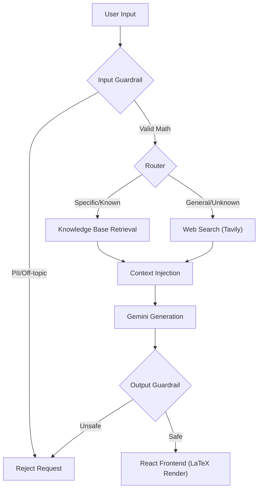

# 🧠 Agentic Math Solver


> **An agentic RAG system for mathematical problem solving that routes between an internal knowledge base and external web search.**

## 🧪 Architecture Flow

The system uses **LangGraph** to manage a state graph for routing, retrieval, generation, and guardrail checks.


```mermaid
graph TD
    A["User Input"] --> B{"Input Guardrail"}
    B -- "PII/Off-topic" --> C["Reject Request"]
    B -- "Valid Math" --> D{"Router"}
    D -- "Specific/Known" --> E["Knowledge Base Retrieval"]
    D -- "General/Unknown" --> F["Web Search (Tavily)"]
    E --> G["Context Injection"]
    F --> G
    G --> H["Gemini Generation"]
    H --> I{"Output Guardrail"}
    I -- "Safe" --> J["React Frontend (LaTeX Render)"]
    I -- "Unsafe" --> C
```

| Component | Function |
| :--- | :--- |
| **Input Guardrail** | Regex & keyword checks for PII and topic relevance. |
| **Router** | Chooses between Qdrant retrieval and Tavily web search. |
| **Retrieval** | Fetches relevant context to ground the LLM response. |
| **Generation** | **Google Gemini 2.5 Flash** synthesizes context into a step-by-step solution. |
| **Frontend** | React + KaTeX for mathematical notation rendering. |

## 🚀 Getting Started

### Prerequisites

* Docker Desktop (for Qdrant)
* Python 3.11+
* Node.js 18+

### 1. Database Setup

```bash
docker-compose up -d qdrant
```

### 2. Backend Setup

```bash
cd backend
python -m venv venv
source venv/bin/activate  # Windows: venv\Scripts\activate
pip install -r requirements.txt

# Create .env with GOOGLE_API_KEY and TAVILY_API_KEY
touch .env
```

Load the knowledge base:

```bash
python ../notebooks/load_kb.py
```

Start the API:

```bash
uvicorn main:app --reload
```

Server: `http://127.0.0.1:8000`

### 3. Frontend Setup

```bash
cd frontend
npm install
npm run dev
```

App: `http://localhost:5173`

## 🤝 Human-in-the-Loop Feedback

User feedback is captured by the UI and stored in `data/feedback_dataset.jsonl` for later evaluation, prompt optimization, or fine-tuning experiments.

## 📂 Repository Structure

```text
├── backend/             # FastAPI + LangGraph application
├── frontend/            # React + Vite application
├── data/                # Qdrant storage and feedback logs
├── notebooks/           # Knowledge-base loading / experiments
├── docker-compose.yml   # Qdrant infrastructure
└── test_graph.py        # Graph behavior checks
```

## 🚀 System Capabilities

- [x] **Agentic RAG routing** with LangGraph
- [x] **Qdrant knowledge base**
- [x] **Tavily web search**
- [x] **Input/output guardrails**
- [x] **Human feedback capture**
- [x] **FastAPI backend + React frontend**

The system is designed as an engineering portfolio project; mathematical answers should still be independently verified for high-stakes use.
